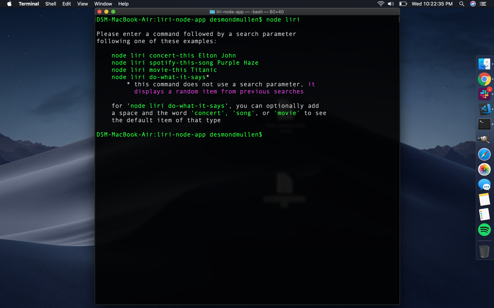
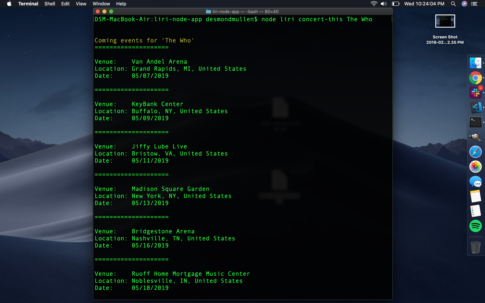
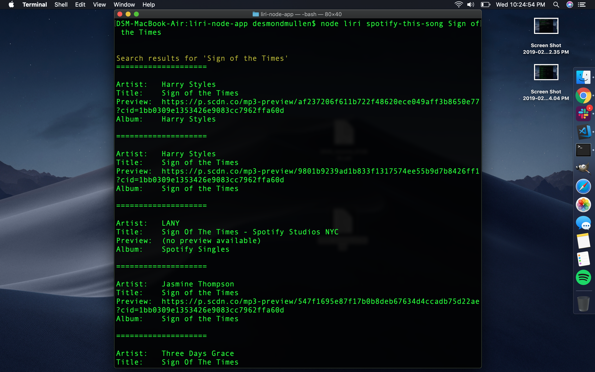
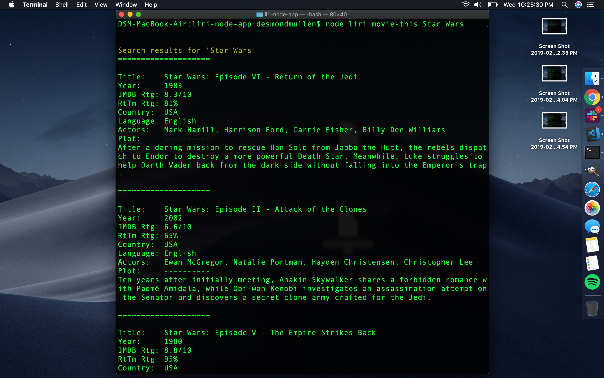
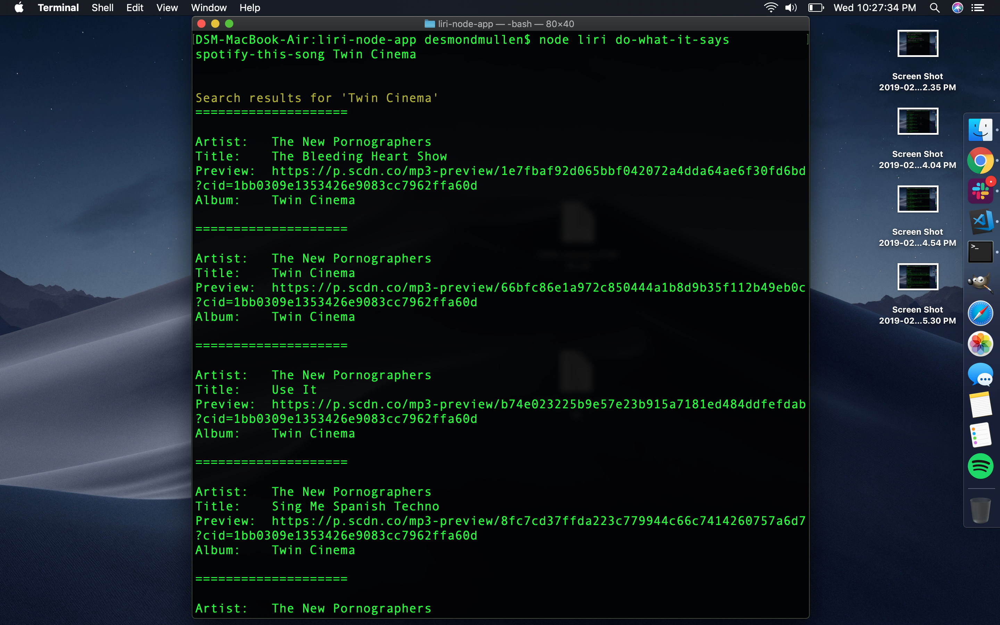
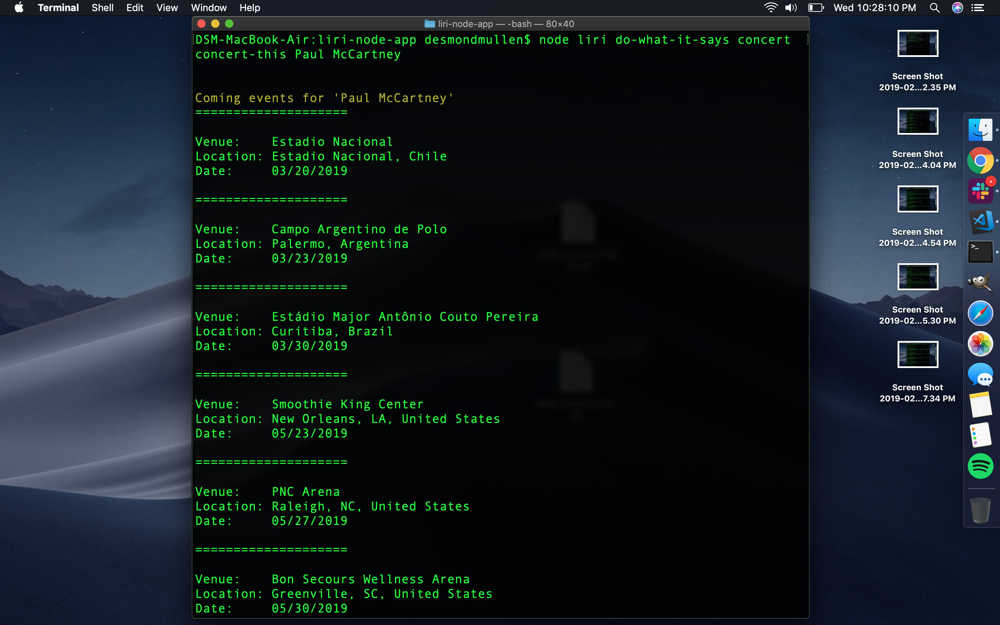
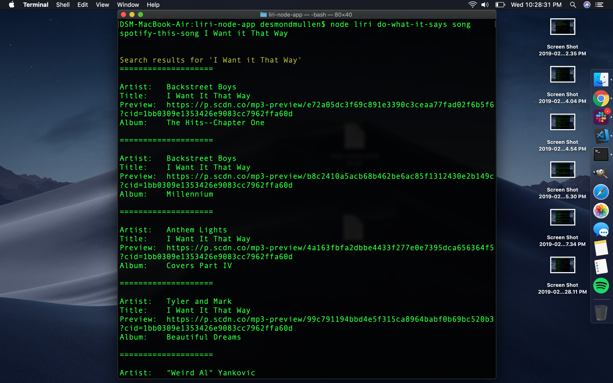
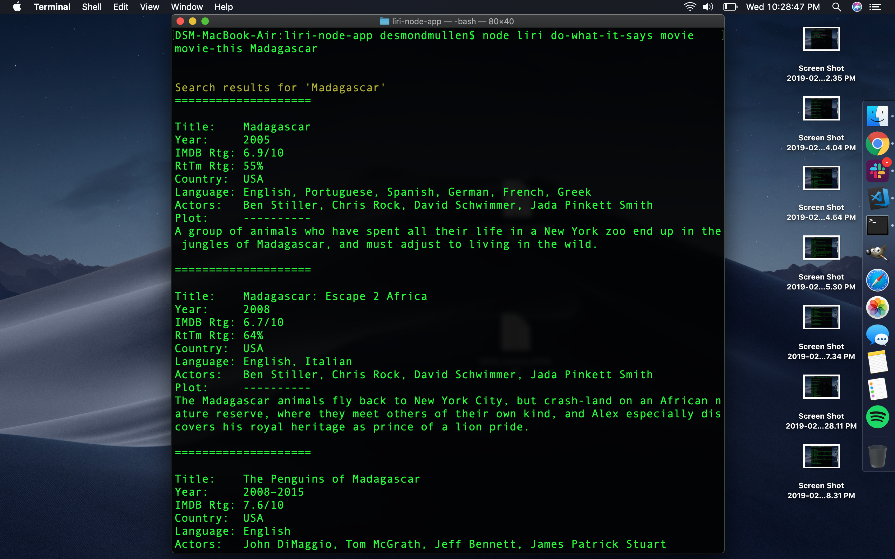

# liri-node-app

**This "Language Interpretation and Recognition Interface" node app takes user queries and retrieves data from Bandsintown, Spotify, and OMDB (as appropriate) and parses and formats the results cleanly to present readable information in a consistent format back to the user.**

# Features
In addition to the basic functions of collecting user queries, retrieving data for the queries, outputting readable data, this app does the following:

### ADDITIONAL FEATURES:
* User is presented with basic instruction and examples of the use of the app if they type `node liri help`, or simply `node liri` without any parameters.
* Minor implementation of chalk to make the examples-of-use and search action "headlines" easier to read.
* Every use of the app writes data to a log file. Instead of logging the full results of each search, I chose to log only the search parameters (e.g., 'concert-this Paul McCartney') so that log.txt - the list of past searches - could be easily used to generate random searches when a user types `node liri do-what-it-says` without additional parameters.
* Additionally, do-what-it-says can be invoked with a simple parameter ('concert', 'song', or 'movie', e.g., `node liri do-what-it-says concert` to get results for the corresponding "default" searches contained in the random.txt file.

### SCREENSHOTS:
1. `node liri` without arguments brings up basic instructions and examples:

2. `node liri concert-this The Who`:

3. `node liri spotify-this-song Sign of the Times`:

4. `node liri movie-this Star Wars`:

5. `node liri do-what-it-says` gets random search query from log.txt:

6. `node liri do-what-it-says concert` gets concert example from random.txt:

7. `node liri do-what-it-says song` gets song example from random.txt:

8. `node liri do-what-it-says movie` gets movie example from random.txt:
